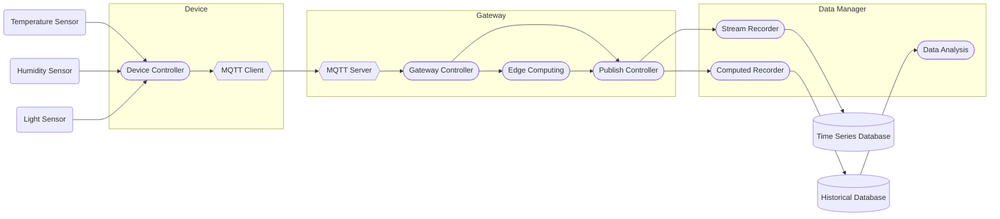

# Weather Twin
This is a project oriented to design and develop an IoT system to allow collect, store and analyze data from several sensors.

## High-level architecture
This project consists in some elements connected to perform the complete solution. In this diagram, each element is represented with their connections:

The application consists in three types of elements:

* **Device**: The physical element which records some information from several sensors, like light sensor, temperature sensor, humidity sensor,... The device has a internal code which performs the data recollection and a MQTT client to send the sensors information to the gateway.
* **Gateway**: This element takes messages from multiple devices through an mebedded MQTT server inside it and sends it to the centralized server to store and analyze data. Alose makes some computing of the information before to send the data.
* **Data Manager**: Is the centraliced server used to redirect all information to databases and make some analysis over the recollected data. Also serves a web application to explore the data and configure the application.

## Technologies
### Spring Modulith
For the gateway application it's used Spring Modulith, a project inside Spring framework used to design and develop monolithic applications with a well-defined modules, to ensure a ordered and clean structure. The decision to select Spring and Modulith as technologies for this application is because Java and Spring are the technical stack that I know best, and Spring is maintained by a large community and companies, which provides great security in terms of support; in the case of Modulith, the gateway application is designed to run in low-resource devices, like a Raspberry Pi Zero, or similars, so, a monolithic application, with a low memory and CPU consumption is the best solution for a Java-based project.