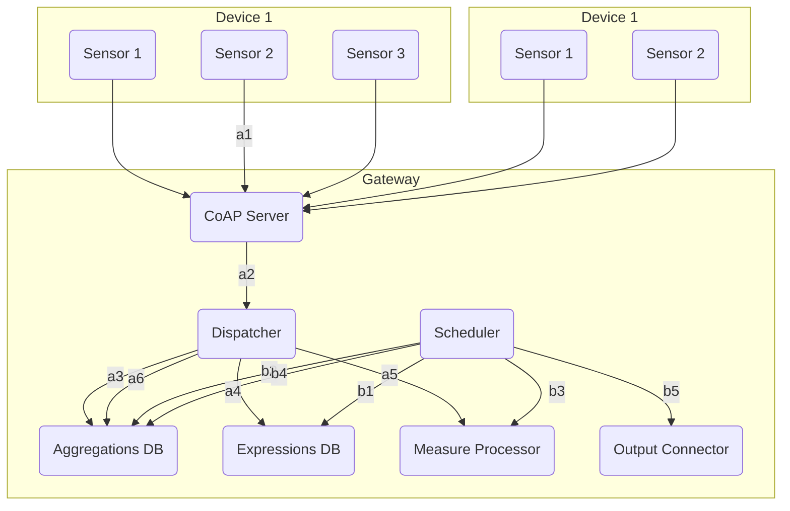
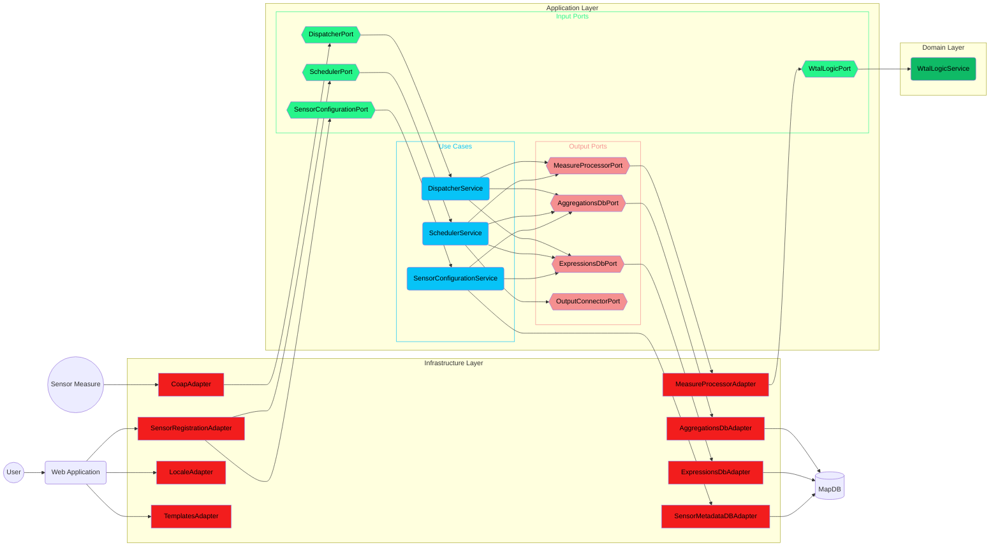

# Gateway

Application responsible for consume all IoT messages from different devices, aggregate them and send these aggregations to other services.

## ✨ Description
This application allow users to process multiple measures collected from IoT sensors and process them. The communication with IoT sensors and the gateway is using *CoAP* protocol, which is a protocol similar to HTTP, but more efficient in content size, specially designed for IoT world.

This gateway collects all measures received by IoT sensors and, to be more efficient, don't stores all measures received; each measure is aggregated with old ones, using an aggregation function described by the user in the configuration, using a custom language called WTAL [Weather-Twin Aggregation Language](#weather-twin-aggregation-language).

The diagram below explains, in high level, how the information is processed by the gateway.

The diagram has its connections marked with codes. Codes which starts with 'a' represents the flow of a measure sent from a sensor; on the other hand, the codes which starts with 'b' represents the flow of a execution of a scheduled task which takes the aggregated value, process it and sends to an external system.

### Measure aggregation flow
* a1. A sensor inside a device sends its measure to the *CoAP Server*.
* a2. The *CoAP Server* checks the message from sensor and sends it to the *Dispatcher*.
* a3. The *Dispatcher* obtains last aggregated value for the sensor.
* a4. The *Dispatcher* obtains the aggregation expression registered for the sensor.
* a5. The *Dispatcher* sends the current measure, the aggregated value and the aggregation expression to the *Measure Processor* and obtains the result.
* a6. The *Dispatcher* updates the aggregation for the sensor with the result of *Measure Processor*.

### Aggregation flush flow
* b1. A programmed task in the schedule is launched and takes the flush expression from database.
* b2. The *Scheduler* takes de aggregated value from database.
* b3. The *Scheduler* sends the aggregated value and flush expression to *Measure Processor* and obtains the result.
* b6. The *Scheduler* releases the aggregated value, this is, puts the aggregated value to the default value programmed by user.
* b5. The *Scheduler* sends the result to external systems.

## 🏗️ Technical stack
### Languages
####  Java 25.0.1

### Frameworks
####  Spring Boot 4.0.0
####  Eclipse Californium 3.14.0
####  ANTLR 4.13.2

####  SpringDoc 1.8.0
### Databases

####  MapDB 3.1.0

## 🏠 Architecture
The diagram below explains how the Gateway's software elements are distributed and interconnected, applying hexagonal architecture.

## 🈺 Weather-Twin Aggregation Language
The WTAL is a customized language used to specify operations to aggregate measures and process aggregations before to be sent. It's an expression language created using ANTLR, and, in this section, is specified the language rules:

### Valid types
First of all, this languages allows some value types, listed below:

* **INTEGER**: 32-bit Integer numbers.
* **FLOAT**: 32-bit Floating-point numbers. 
* **STRING**: Text.
* **BOOLEAN**: Boolean value, true or false.
* **JSON**: JSON object.
* **ARRAY**: List of values.
* **NULL**: Null representation.

### Expression definition
To define an expression in WTAL, it's required to end it using a semicolon, and the last expression is used as result. All expression is defined in the same line, new line character don't applies:

    3 + 4;

WTAL allows to declare variables, but each variable declaration requires to be separated with a semicolon:

    A = 3 + 4; A + 5;

Also, parenthesis are allowed:

    A = 3; (A + 5) / 6;

Due to WTAL is a minimalistic language, used to define simple expressions, **comments are not allowed**.

### Basic Operations
WTAL declares some operations between values, and each operation is performed different, based on the types of both values:

#### Add
The add operation is different, depending on operands:

* Both operands are numbers: Is a typical numeric add.

        1 + 3; Returns 4
        1.2 + 5.6; Returns 6.8

* Left operand is a STRING and the other operand is any type: Appends at the end of STRING value the string representation of right operand.

        "Number: " + 3; Returns "Number: 3"
        "Number: " + 4.5; Returns "Number: 4.5"
        "Hello" + " world!"; Returns "Hello world!"
        "The result is: " + true; Returns "The result is true"
        "My object: " + {"key": 2}; Returns "My object: {\"key\":2}"
        "My array: " + [1,2,3]; Returns "My array: [1,2,3]"

* Left operand is an ARRAY and the other operand is any type: Adds the right value to the left aray.

        [] + 3; Returns [3]
        [3] + 1.5; Returns [3,1.5]
        [3,1.5] + "Hi!"; Returns [3,1.5,"Hi!"]
        [3,1.5,"Hi!"] + false; Returns [3,1.5,"Hi!",false]
        [3,1.5,"Hi!",false] + {"key": 2}; Returns [3,1.5,"Hi!",false,{"key": 2}]
        [3,1.5,"Hi!",false,{"key": 2}] + [1,"a",true]; Returns [3,1.5,"Hi!",false,{"key": 2},[1,"a",true]]

For any other combination of value types, the operator fails.

#### Substract
The substract operation is only allowed between two numbers and is performed as a typical numeric substraction.

    2 - 7; Returns -5
    4.5 - 2.3; Returns 2.2

#### Product
The product operation is allowed between two numbers, operating as a typical numeric product, and between an STRING, as the left operand, and an INTEGER, as the right operand, operating as a STRING repeat, obtaining a new string containing the original string as many times as the INTEGER operand.

    4 * 5; Returns 20
    3.4 * 6.7; Returns 22.78
    "Hi!" * 4; Returns "Hi!Hi!Hi!Hi!"

#### Division
The division operation is only allowed between two numbers and is performed as a typical numeric division.

    5 / 6; Returns 0.83333333
    2.3 / 9; Returns 0.2555555

#### Negative
The negation is allowed only for numbers and transforms the positive numeric value into negative and vice-versa.

    -23; Returns -23

#### And
The and operation is different depending of operands:

* Both values are BOOLEAN: Applies as a typical and operator between booleans:

        true & true; Returns true
        true & false; Returns false

* Both values are JSON: Creates a new JSON with all entries of both JSON. If both operands has a same key, the value that remains is the included in the right operand:

        {"key":1} & {"key1":"Hi"}; Returns {"key":1,"key1":"Hi"}
        {"key":1} & {"key":[1,2,3]}; Returns {"key":[1,2,3]}

* Both values are ARRAY: Creates a new ARRAY with all elements of both ARRAY. The returned ARRAY has the elements ordered, first the left operand items and then, the right ones:

        [1,2,3] + ["a", 5, false]; Returns [1,2,3,"a",5,false]

For any other combination of value types, the operator fails.

#### Or
The or operation is only allowed between BOOLEAN values, and applies as a typical boolean or.

    true | false; Returns true
    false | false; Returns false

#### Greater than
This operation is only allowed between numeric values, and applies as a typical numeric greater than operation.

    4 > 5; Returns false
    3.6 > 1.5; Returns true

#### Less than
This operation is only allowed between numeric values, and applies as a typical numeric less than operation.

    4 < 5; Returns true
    3.6 < 1.5; Returns false

#### Equals
This operation is allowed with any pair of types and is performed as Java equals operation.

    3 == 3; Returns true
    3 == "3"; Returns false

#### Greater or equals than
This operation is only allowed between numeric values, and applies as a typical numeric greater or equals than operation.

    4 >= 5; Returns false
    5 >= 5; Returns true
    6 >= 5; Returns true

#### Less or equals than
This operation is only allowed between numeric values, and applies as a typical numeric less or equals than operation.

    4 <= 5; Returns true
    5 <= 5; Returns true
    6 <= 5; Returns false
    

#### Index access
It's only allowed for ARRAY and STRING types. The index access is represented as square brackets attached to the right of the value or variable and an integer, or two integers separated by a colon.

When the index access uses a single integer inside the brackets, takes a single value from ARRAY or STRING, from the position indicated by the index, starting at zero:

    [1,2,3,4][3]; Returns 4
    "Hello world!"[1]; Returns "e"

If the single integer is negative, returns the value with same index of substract the negative value to the size of ARRAY or STRING:

    [1,2,3,4][-1]; Returns 4, because 4 - 1 is equals than 3
    "Hello world!"[-3]; Returns "l", because 12 - 3 is equals than 9

If the single integer is not a valid index, because is greater than ARRAY or STRING size, or less than zero after calculate the negative index, returns null:

    [1,2,3,4][4]; Returns null
    "Hello world!"[-13]; Returns null, because 12 - 13 is -1

When the index is a range, returns a subset of elements, with left index included and right one excluded:

    [1,2,3,4,5,6,7][1:4]; Returns [2,3,4]
    "Hello world!"[5:10]; Returns " worl"

A range allows negative indexes too, and works as single index:

    [1,2,3,4,5,6,7][-5:-1]; Returns [3,4,5,6], because [-5:-1] is translated as [2:6]
    "Hello world!"[-11:-7]; Returns "ello", because [-11:-7] is translated as [1:5]

If the range has indices outside the iterable element, the result is different depending on type:

* For ARRAY values, the result is an array with the same size as expected, but all indices outside array limits are filled in result array with nulls:

        [1,2,3,4][2:9]; Returns [3,4,null,null,null,null,null]
        [1,2,3,4][-8:2]; Returns [null,null,null,null,1,2]

* For STRING values, the result is an string with only the indices inside STRING limits, the rest of indices are no included in the result STRING:

        "Hello world!"[5:20]; Returns " world!"
        "Hello world!"[-20:10]; Returns "Hello worl"

The index access operator is not allowed to any other value type.

#### Name access
This operator is only allowed for JSON values, and allows to take the value related to a key name, or null if JSON value hasn't the key. This operator is represented as a brackets with a string inside, this string is the key search inside the JSON value.

    {"key":1}["key"]; Returns 1
    {"key":1}["ke"]; Returns null

#### Includes
This operator is allowed only for STRING, ARRAY and JSON values and applies different for each type.

* For STRING values: Searches an STRING value inside another STRING. The left operand is the STRING to search and the right operand the STRING where the left operand is searched for. The left operand can be a regex too. Returns true if the left STRING is included in right one, or if any substring of right STRING applies the left regex.

        "hello" IN "world"; Returns true
        "ABC" IN "DEF"; Returns false
        "\d+" IN "hello 1234"; Returns true

* For ARRAY values: Checks if any item inside right ARRAY operand is equals than the left operand, which can have any type.

        1 IN [1,2,3,4]; Returns true
        "A" IN [1,"A"]; Returns true
        10 IN [1,2,3,4]; Returns false

* For JSON values: Checks if the right JSON operand contains any key with same value as left STRING operand.

    "key" IN {"key":1}; Returns true
    "any" IN {"key":1}; Returns false

### Functions
WTAL also defines some functions which can be called on expressions.

#### POW
This function is used to calculate the exponent of a number. Is called passing two numeric parameters, first, the base, and second, the exponent. Returns the base number evelated to the exponent.

    POW(2,3); Returns 8

#### SQRT
This function is used to calculate the cuadratic root of a number. Is called passing a number and returns the result, as a number.

    SQRT(4); Returns 2

#### ISNULL
This function allows to check is a value is NULL. Returns true if the value is NULL, else false.

    my_var = NULL; ISNULL(my_var); Returns true
    my_var = 1; ISNULL(my_var); Returns false

#### TERNARY
Performs a ternary operator, like the Java's ternary operator (boolean_expression ? value_if_true : value_if_false). Takes three parameters, a boolean expression, a value to return if boolean expression is true and a value to return if boolean expression is false.

    TERNARY("A" IN ["A","B","C"], 1, 2); Returns 1
    TERNARY("A" IN [1,2,3], 1, 2); Returns 2 

#### MOD
Returns the remainder of a division. Takes two parameters, the two numbers to calculate the remainder of the division.

    MOD(4, 2); Returns 0
    MOD(4, 3); Returns 1

#### MAP
This function applies to ARRAY values and allows to generate a copy of an ARRAY with all values changed, based on a mapping function. This function takes two parameters, an ARRAY value and a function, defined with the name *item*, followed by an arrow (->) and another expression, which its result is the value to replace in the result ARRAY.

    MAP([1,2,3,4], item -> item * 2); Returns [2,4,6,8]

#### FILTER
This function applies to ARRAY values and allows to generate a copy of an ARRAY, keeping only the elements which passes a filter function. This function takes two parameters, an ARRAY value and a function, defined with the name *item*, followed by an arrow (->) and another expression which needs to return a boolean value. If the function doesn't return a boolean value, the function fails.

    FILTER([1,2,3,4,5,6,7,8], item -> MOD(item) == 0); Returns [2,4,6,8]
